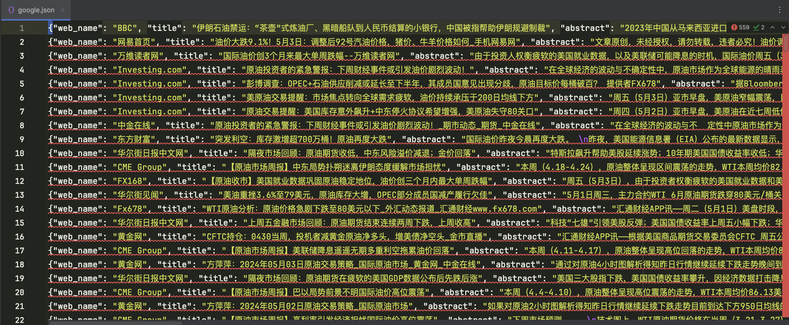

## Google News Spider


#### ①项目介绍

谷歌新闻爬虫。输入新闻关键词，爬取Google新闻，存储到本地json文件


#### ② 环境安装

进入项目根目录

```shell
pip install -r requirements.txt
```


#### ③ 项目启动

##### 1. 环境变量中配置爬取关键词

```python
# eg:
KEYWORD=金融
```


##### 2. 日志配置

```shell
# 默认日志路径
LOG_PATH=./logs/google/
```


##### 3. 启动爬虫

```shell
# 1. 直接运行main.py

# 2. 命令行执行
scrapy runspider google_spider/spiders/google_crawl.py
```

当前爬取数据存储到本地json文件中


#### ④ 数据样例

